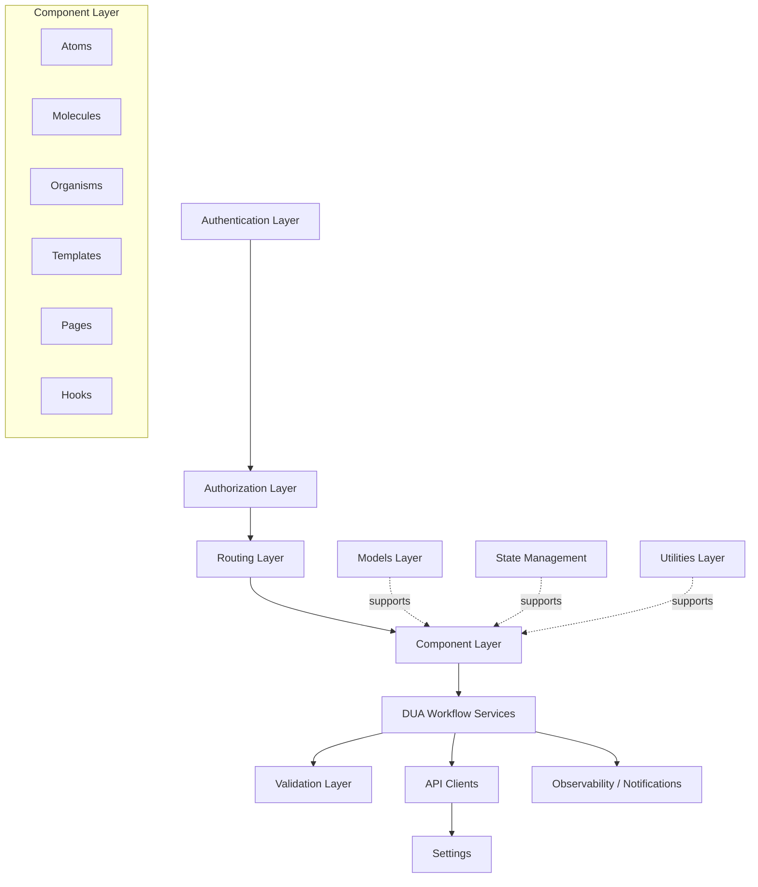

# CASE #1
### **Author:** José Gabriel Marín Aguilar c.2022119819

## Problem Overview

The Documento Único Aduanero (DUA) is the official customs declaration document required for import and export operations in Costa Rica, regulated by the Ministerio de Hacienda.

Preparing a DUA requires interpreting heterogeneous documents such as invoices, packing lists, certificates of origin, transport documents, and permits. These files vary in format (Excel, Word, PDF, scanned images), structure, terminology, and quality. Manual preparation is:
- Repetitive
- Error-prone
- Highly dependent on expert knowledge
- Time-consuming

## Proposed Solution

DUA Streamliner is an AI-powered system that ingests a folder containing heterogeneous trade documents, extracts relevant customs data using semantic models, maps the information into the official DUA template, and generates a pre-filled Word document with confidence indicators.

The system does not replace the customs expert; it reduces operational workload and shifts the expert’s role toward validation and decision-making.

|Pros|Cons|
|----|-------|
|Reduces manual workload|OCR accuracy depends on document quality|
|Minimizes data entry errors|AI extraction requires continuous validation|
|Standardizes DUA preparation|Legal responsibility remains with the declarant|
|Improves processing time||
---

# 1. Frontend Design 

## 1.1 Technology Framework

- **Application type:** Web application fully responsive for tablet and mobile access.
- **Web Framework:** React 19.2
- **Runtime:** Node.js 21.x
- **Coding Language:** TypeScript 5.9.3
- **Bundler:** Vite 6.x
- **UI Framework:** MUI 6.x
- **Routing:** React Router DOM 6.25.x
- **Authentication Protocol:** OAuth2 / OpenID Connect (OIDC Client TS 3.x)
- **Unit Testing:** Jest 30.2.0
- **Data Validation:** Zod 3.x
- **Code prettier framework:** Prettier 3.x
- **Code style framework:** ESLint 9.x with @typescript-eslint 7.x
- **Integration testing tools:** Playwright 1.58.2
- **Cloud service:** Amazon Web Services (AWS)
- **Hosted services within the cloud service:**
    - AWS ECS Fargate
    - AWS Elastic Container Registry (ECR)
    - AWS Application Load Balancer (ALB)
    - AWS CloudFront
    - AWS CloudWatch
    - AWS Certificate Manager (ACM)
- **Code repositories service:** GitHub
- **Code automation task tool:** npm scripts (Node.js 21.x runtime)
- **CI CD pipelines technology:** GitHub Actions
- **Environments:**
    - Development
    - Quality Assurance
    - Stage
    - Production
- **Environment deployment tools:**
    - Docker 25.x
    - Terraform 1.8.x
    - AWS CLI 2.x
- **Observability framework:**
    - AWS CloudWatch
    - OpenTelemetry JS 1.x
    - Sentry 
---
## 1.2 UX/UI Analysis
### Core Business Process
The application allows customs operators to automatically generate a Documento Único Aduanero (DUA) from multiple source documents.

Users authenticate using their credentials and a one-time token sent to their email. Once logged in, they can either review previously generated DUAs or initiate the creation of a new one.

When generating a new DUA, the user configures the generation parameters such as accepted document formats and the template version to be used. The system then processes the uploaded documents, extracts the relevant customs information using AI models, and maps the data into the official DUA structure.

During processing, the user can monitor the progress of the extraction and generation process. Once completed, the system displays the generated DUA in a PDF viewer where the user can review and download the final document.

### Wireframes
#### **User Login**
The user logs into the system using their username, password, and a one-time authentication token received via email.


#### **Select Option**
After authentication, the user can choose between generating a new DUA or reviewing previously generated declarations.


#### **DUA History**
The system displays a list of previously generated DUAs associated with the user account. Each record can later be expanded or downloaded.


#### **Generator Configuration**
The user configures the generation process before uploading documents.

Configuration options include:
- Accepted document formats (PDF, Image, Word, Excel)
- DUA template version (latest from the Ministry of Finance or custom uploaded template)
- AI extraction mode (fast scan / detailed extraction)


#### **Upload Files**
The user uploads the commercial documents required to generate the DUA.
Files can be uploaded using drag-and-drop or manual selection.
Supported formats include:
- PDF
- DOCX
- XLSX
- Images


#### **Processing Progress**
During the document processing stage, the user can monitor the progress of the generation pipeline. The interface displays a progress bar and indicates the current step of the process.


#### **DUA Result**
Once the process is completed, the generated DUA is displayed in a PDF preview interface. The user can review the document and download it as a PDF file.


### Alternative view

Another version of the wireframes can be found here: [Coderick AI generated wireframes](https://preview-vc528368378939.coderick.net/?sgv=1772815747%3A26d1a14eb8605cde34bc344fd853adfda4a649cf18defbcff34d53228f4bfa68)

---

## 1.3 Component Design Strategy 
DUA Streamliner uses Atomic Design over a component-based React architecture. The interface is built from small reusable UI elements that are progressively composed into larger components and full pages. This approach improves consistency, maintainability, and scalability, while keeping presentation concerns separate from business logic.

Reusability is achieved by implementing shared UI elements only once and reusing them across screens. Common controls such as buttons, text fields, dialogs, upload areas, progress bars, tables, alerts, and PDF preview containers are placed in a shared component layer. Feature-specific components are then composed from those base elements. This reduces duplication and ensures that the same interaction patterns are preserved across the full application.

Styling is centralized through a single theme layer built on top of MUI. Colors, typography, spacing, border radius, shadows, and component variants are defined in one place and propagated through the full application. This allows visual updates to be applied globally without modifying business components. Branding is handled in the same layer by defining the project color palette, logo usage, icon rules, and UI tokens as part of the shared theme configuration.

Internationalization is implemented through a centralized i18n configuration, where all user-facing labels, messages, button texts, and validation messages are externalized into locale files instead of being hardcoded inside components. This makes the UI language-independent and simplifies future support for multiple languages, currencies, and regional formats.

Responsiveness is addressed at the component level using responsive layouts, breakpoints, and adaptive sizing rules. Components are designed to work consistently across desktop, tablet, and mobile browser widths, while preserving readability and workflow clarity. Since responsiveness is solved in the shared component system, the behavior propagates to the rest of the screens without redefining each page independently.

Accessibility is also enforced at the component level. Shared components follow consistent semantic structure, keyboard navigation rules, visible focus states, sufficient contrast, and reusable feedback patterns. This makes accessibility improvements scalable, because once a shared component is improved, the change benefits all screens that reuse it.

Strategy Summary

- Name of the strategy: Atomic Design with component-based React architecture
- Reutilization by: shared base components, feature composition, and centralized UI patterns
- Internationalization by: centralized i18n resources and locale-based text rendering
- Responsiveness by: responsive MUI layouts, breakpoints, flexible containers, and adaptive component sizing

### Suggested Component Structure
```
src/
  components/
    atoms/
    molecules/
    organisms/
    layouts/
  features/
    authentication/
    dua-generator/
    dua-history/
  theme/
  i18n/
  pages/
```

---

## 1.4 Security
Security in the DUA Streamliner platform is designed following modern web application security principles, focusing on secure authentication, controlled authorization, and safe management of sensitive information. The system combines token-based authentication, role-based authorization, and secure storage of credentials to protect both user data and system operations.

### Authentication

User authentication is implemented using a token-based mechanism with JSON Web Tokens (JWT). When a user logs in using their credentials (email and password), the backend validates the credentials and generates a signed JWT token that represents the authenticated session. This token is then sent to the client and included in subsequent API requests to verify the identity of the user.

Passwords are never stored in plain text. Instead, they are securely hashed using industry-standard algorithms (such as bcrypt) before being stored in the database. This ensures that even if the database were compromised, user credentials would remain protected.

Although the current implementation uses a single-factor authentication (password-based login), the architecture allows the future integration of Multi-Factor Authentication (MFA). MFA would add an additional verification step such as a One-Time Password (OTP) sent via email or generated by an authenticator application, significantly increasing account security.

### Single Sign-On Considerations

The system currently uses an independent authentication mechanism rather than a Single Sign-On (SSO) provider. This approach simplifies the architecture and allows full control over user management inside the application.

However, the architecture is compatible with future integration of third-party identity providers such as Google authentication. Implementing SSO could improve user convenience and reduce password management risks, but for the scope of this project an internal authentication system provides sufficient control and security.

### Session Management

Session management is handled using stateless authentication tokens. After successful login, the backend issues a JWT token containing the user's identity and authorization claims. This token has a defined expiration time and must be included in the header of protected API requests.

Using stateless tokens improves scalability and simplifies backend session management since the server does not need to maintain session state. Token expiration and optional refresh tokens help prevent long-term misuse if a token is compromised.

### Authorization

Authorization in the system is implemented using Role-Based Access Control (RBAC). Each authenticated user is assigned a role, and each role defines the actions that the user is allowed to perform within the platform.

Typical roles within the system include:

- Importer / Exporter – Users who generate and manage DUA declarations.
- Customs Officer – Users who review submitted declarations.
- Administrator – Users who manage system configurations and permissions.

RBAC simplifies permission management while maintaining clear separation of responsibilities between different user groups. The authorization rules are enforced in the backend through middleware or guards that validate the user's role and permissions before executing protected operations.

### Access Control Model

The platform primarily uses RBAC for authorization. Access to the system itself is controlled through authenticated accounts rather than open public access lists. Therefore, only registered users with valid credentials can access the platform.

Although RBAC is sufficient for the current scope, the architecture allows extending the model to include Policy-Based Access Control (PBAC) if more complex access rules become necessary in the future.

### Permissions and Claims

Permissions within the system are defined using structured claims, which represent the actions a user can perform. These claims can be embedded inside the authentication token or validated on the server side.

| Code               | Description                                                       |
| ------------------ | ----------------------------------------------------------------- |
| CREATE-DUA         | Allows the user to generate a new DUA declaration.                |
| UPLOAD-DOCUMENT    | Allows the user to upload supporting documents for a declaration. |
| VIEW-DUA           | Allows the user to view previously generated declarations.        |
| EDIT-DUA           | Allows the user to modify declaration data before submission.     |
| REVIEW-DUA         | Allows customs officers to review submitted declarations.         |
| ADMIN-MANAGE-USERS | Allows administrators to manage user accounts and roles.          |


These claims are evaluated by the backend authorization layer to ensure that users only perform actions allowed by their role.

### Secure Storage of Sensitive Data

Sensitive configuration data such as API keys, database credentials, authentication secrets, and environment variables are not stored directly in the source code repository. Instead, they are managed using environment variables stored in a .env configuration file.

For deployment environments, sensitive values should be stored using a secure secrets management service, such as a cloud-based key vault. These services securely store encryption keys, tokens, and credentials while restricting access through controlled permissions.

Typical sensitive data managed in secure storage include:

- JWT signing keys
- Database connection credentials
- API keys for external services
- Environment-specific configuration variables

This approach prevents exposure of sensitive data in version control systems and ensures that secrets can be rotated or revoked securely.

---

## 1.5 Layer Design
The DUA Streamliner frontend is organized as a layered architecture by responsibility. Each layer isolates a specific concern of the web application, allowing the UI, workflow orchestration, security, validation, external communication, and system configuration to evolve independently. This improves maintainability, testability, and consistency across the main flows of the platform.

The execution starts in the Authentication Layer and Authorization Layer, which control secure access, session awareness, and role-based route protection. The Routing Layer connects the main application screens and defines protected navigation between login, history, generator configuration, upload, processing, and result pages.

The Component Layer is the visual layer of the application and follows the Atomic Design strategy already selected for the project. It is composed of atoms, molecules, organisms, templates, and pages. React hooks are placed close to this layer because they are triggered from components and coordinate user interactions such as login submission, document upload, DUA generation, and history loading.

Below the UI, the DUA Workflow Services layer orchestrates the main frontend use cases. It coordinates authentication flow, file upload, generation requests, progress tracking, history retrieval, and result delivery. This layer consumes API Clients, applies the Validation Layer before and after external calls, and reads configuration from the Settings layer.

The architecture is supported by cross-cutting layers. The Models Layer defines frontend domain objects such as User, DUA, Document, Goods, and GenerationJob. The State Management layer stores global application state such as session status, current workflow step, generated declarations, and upload progress. The Utilities Layer contains reusable helpers and formatters. Finally, the Observability / Notifications layer captures frontend errors, telemetry events, process logs, and user-facing notifications.

### Typical Responsability Layers
- Authentication Layer
- Authorization Layer
- Routing Layer
- Component Layer
- Hooks Layer
- DUA Workflow Services
- Validation Layer
- API Clients Layer
- Settings Layer
- Models Layer
- State Management
- Utilities Layer
- Observability / Notifications

### Suggested Folder Architecture
```
src/
  auth/
    authProvider.tsx
    authGuard.tsx
    permissionGuard.tsx

  router/
    appRouter.tsx
    protectedRoute.tsx

  components/
    atoms/
    molecules/
    organisms/
    templates/
    pages/

  hooks/
    useAuth.ts
    useDuaGeneration.ts
    useUploadDocuments.ts
    useDuaHistory.ts

  services/
    authService.ts
    duaGenerationService.ts
    fileUploadService.ts
    duaHistoryService.ts
    notificationService.ts

  api/
    httpClient.ts
    authApiClient.ts
    duaApiClient.ts
    uploadApiClient.ts

  validation/
    authSchemas.ts
    uploadSchemas.ts
    duaSchemas.ts
    responseSchemas.ts

  state/
    store.ts
    slices/

  models/
    User.ts
    DUA.ts
    Document.ts
    Goods.ts
    GenerationJob.ts

  utils/
    formatters.ts
    fileHelpers.ts
    dateUtils.ts

  settings/
    env.ts
    routes.ts
    constants.ts

  observability/
    logger.ts
    telemetry.ts
    errorTracking.ts
```
### Execution Flow
- The user enters the application through the authentication flow.
- Authorization and routing validate access to protected screens.
- Pages are built from atoms, molecules, organisms, templates, and hooks.
- Hooks trigger DUA workflow services.
- Services validate input and delegate backend communication to API clients.
- API clients use centralized settings and endpoints.
- Responses are validated and mapped into frontend models.
- State management stores the updated session, workflow, and result data.
- Components re-render the UI.
- Observability captures logs, errors, progress events, and notifications.

### Layered Design Diagram

### Mermaid Diagram

---
## 1.6 Design Patterns
The frontend applies object-oriented and architectural patterns only where they add clarity to the workflow.
- The **Provider pattern** is used for authentication context and global UI concerns. It centralizes session awareness and avoids passing auth state through multiple component levels.
- The **Guard pattern** is used for route protection and permission validation. `authGuard.tsx` protects authenticated routes and `permissionGuard.tsx` protects role- or claim-based actions.
- The **Singleton pattern** is used for the shared HTTP client so that API configuration, interceptors, and authentication headers are defined once.
- The **Factory pattern** is used to build frontend domain objects such as `DUA`, `Document`, or `GenerationJob` from API responses before they reach the UI.
- The **Observer pattern** is applied through state subscriptions and reactive UI updates. Components refresh automatically when the global store changes or when async generation progress updates arrive.
- The **Strategy pattern** is used where behavior may vary by configuration, such as document upload handling, template selection, or confidence rendering.
- The **Facade pattern** is used in workflow services. Services expose simple methods to the UI while internally coordinating validation, API calls, settings, and notifications.
- The **Interceptor pattern** is applied in the HTTP layer to inject tokens, handle authorization failures, and support session invalidation.
- The **Pub/Sub or event-driven pattern** is used for notifications and progress events, allowing upload and generation status to update the UI without tight coupling.

### Pattern Usage and Location

| Pattern | Purpose | Main Location |
|---|---|---|
| Provider | Authentication and shared app context | `src/auth/authProvider.tsx` |
| Guard | Route and permission protection | `src/auth/authGuard.tsx`, `src/auth/permissionGuard.tsx` |
| Singleton | Shared HTTP client | `src/api/httpClient.ts` |
| Factory | Build domain models from API data | `src/models/factories/duaFactory.ts` |
| Observer | UI refresh from state changes | `src/state/`, `src/hooks/` |
| Strategy | Variable workflow behavior | `src/services/`, `src/components/` |
| Facade | Simplified orchestration for UI calls | `src/services/` |
| Interceptor | Token injection and session invalidation | `src/api/httpClient.ts` |
| Pub/Sub | Notifications and progress events | `src/services/notificationService.ts`, `src/observability/` |
---
## 1.7 `/src` Scaffold

```text
src/
  auth/
    authProvider.tsx
    authGuard.tsx
    permissionGuard.tsx

  router/
    appRouter.tsx
    protectedRoute.tsx

  components/
    atoms/
      Button.tsx
      InputField.tsx
      ProgressBar.tsx
    molecules/
      LoginForm.tsx
      FileUploadBox.tsx
      ConfidenceBadge.tsx
    organisms/
      HistoryTable.tsx
      GeneratorConfigForm.tsx
      PdfViewerPanel.tsx
    templates/
      AuthTemplate.tsx
      DashboardTemplate.tsx
      WorkflowTemplate.tsx
    pages/
      LoginPage.tsx
      SelectOptionPage.tsx
      DuaHistoryPage.tsx
      GeneratorConfigurationPage.tsx
      UploadDocumentsPage.tsx
      ProcessingProgressPage.tsx
      DuaResultPage.tsx

  hooks/
    useAuth.ts
    useDuaGeneration.ts
    useUploadDocuments.ts
    useDuaHistory.ts

  services/
    authService.ts
    duaGenerationService.ts
    fileUploadService.ts
    duaHistoryService.ts
    notificationService.ts

  api/
    httpClient.ts
    authApiClient.ts
    duaApiClient.ts
    uploadApiClient.ts

  validation/
    authSchemas.ts
    uploadSchemas.ts
    duaSchemas.ts
    responseSchemas.ts

  state/
    store.ts
    slices/
      authSlice.ts
      duaSlice.ts
      uploadSlice.ts

  models/
    User.ts
    DUA.ts
    Document.ts
    Goods.ts
    GenerationJob.ts
    factories/
      duaFactory.ts

  utils/
    formatters.ts
    fileHelpers.ts
    dateUtils.ts

  settings/
    env.ts
    routes.ts
    constants.ts

  observability/
    logger.ts
    telemetry.ts
    errorTracking.ts

  i18n/
    en.json
    es.json

  theme/
    theme.ts
``` 
---