# CASE #1
### **Author:** José Gabriel Marín Aguilar c.2022119819

## Problem Overview

The Documento Único Aduanero (DUA) is the official customs declaration document required for import and export operations in Costa Rica, regulated by the Ministerio de Hacienda.

Preparing a DUA requires interpreting heterogeneous documents such as invoices, packing lists, certificates of origin, transport documents, and permits. These files vary in format (Excel, Word, PDF, scanned images), structure, terminology, and quality. Manual preparation is:
- Repetitive
- Error-prone
- Highly dependent on expert knowledge
- Time-consuming

## Proposed Solution

DUA Streamliner is an AI-powered system that ingests a folder containing heterogeneous trade documents, extracts relevant customs data using semantic models, maps the information into the official DUA template, and generates a pre-filled Word document with confidence indicators.

The system does not replace the customs expert; it reduces operational workload and shifts the expert’s role toward validation and decision-making.

|Pros|Cons|
|----|-------|
|Reduces manual workload|OCR accuracy depends on document quality|
|Minimizes data entry errors|AI extraction requires continuous validation|
|Standardizes DUA preparation|Legal responsibility remains with the declarant|
|Improves processing time||
---

# 1. Frontend Design 

## 1.1 Technology Stack

- **Application type:** Web application fully responsive for tablet and mobile access.
- **Web Framework:** React 19.2
- **Runtime:** Node.js 21.x
- **Coding Language:** TypeScript 5.9.3
- **Bundler:** Vite 6.x
- **UI Framework:** MUI 6.x
- **Routing:** React Router DOM 6.25.x
- **Authentication approach:** Custom JWT-based authentication with email OTP verification
- **Unit Testing:** Jest 30.2.0
- **Data Validation:** Zod 3.x
- **Code prettier framework:** Prettier 3.x
- **Code style framework:** ESLint 9.x with @typescript-eslint 7.x
- **Integration testing tools:** Playwright 1.58.2
- **Cloud service:** Amazon Web Services (AWS)
- **Hosted services within the cloud service:**
    - AWS ECS Fargate
    - AWS Elastic Container Registry (ECR)
    - AWS Application Load Balancer (ALB)
    - AWS CloudFront
    - AWS CloudWatch
    - AWS Certificate Manager (ACM)
- **Code repositories service:** GitHub
- **Code automation task tool:** npm scripts (Node.js 21.x runtime)
- **CI CD pipelines technology:** GitHub Actions
- **Environments:**
    - Development
    - Quality Assurance
    - Stage
    - Production
- **Environment deployment tools:**
    - Docker 25.x
    - Terraform 1.8.x
    - AWS CLI 2.x
- **Observability framework:**
    - AWS CloudWatch
    - OpenTelemetry JS 1.x
    - Sentry 
---
## 1.2 UX/UI Analysis
### Core Business Process
The application allows customs operators to automatically generate a Documento Único Aduanero (DUA) from multiple source documents.

Users authenticate using their credentials and a one-time token sent to their email. Once logged in, they can either review previously generated DUAs or initiate the creation of a new one.

When generating a new DUA, the user configures the generation parameters such as accepted document formats and the template version to be used. The system then processes the uploaded documents, extracts the relevant customs information using AI models, and maps the data into the official DUA structure.

During processing, the user can monitor the progress of the extraction and generation process. Once completed, the system displays the generated DUA in a PDF viewer where the user can review and download the final document.

### Usability Attributes

- Learnability
- Consistency
- Accessibility
- Error prevention
- Clear system feedback
- Efficiency
- Confidence transparency
- Responsive behavior

### Wireframes
#### **User Login**
The user logs into the system using their username, password, and a one-time authentication token received via email.
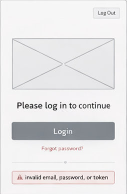
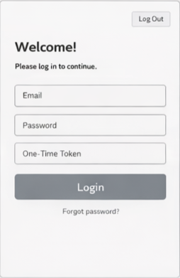

#### **Select Option**
After authentication, the user can choose between generating a new DUA or reviewing previously generated declarations.
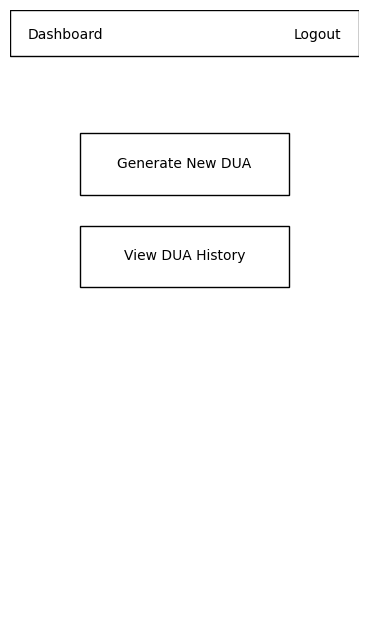

#### **DUA History**
The system displays a list of previously generated DUAs associated with the user account. Each record can later be expanded or downloaded.
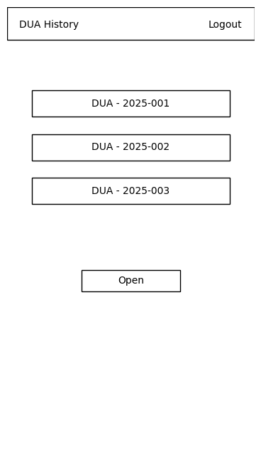

#### **Generator Configuration**
The user configures the generation process before uploading documents.

Configuration options include:
- Accepted document formats (PDF, Image, Word, Excel)
- DUA template version (latest from the Ministry of Finance or custom uploaded template)
- AI extraction mode (fast scan / detailed extraction)

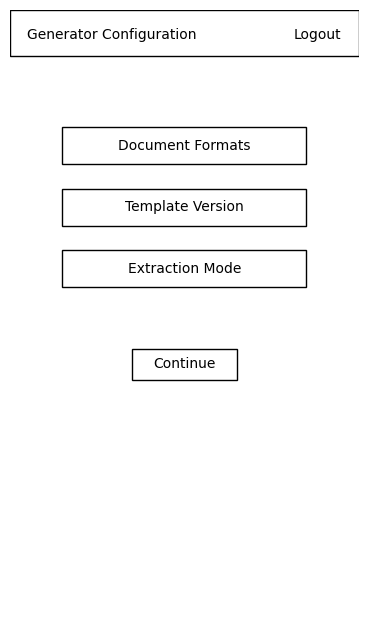

#### **Upload Files**
The user uploads the commercial documents required to generate the DUA.
Files can be uploaded using drag-and-drop or manual selection.
Supported formats include:
- PDF
- DOCX
- XLSX
- Images

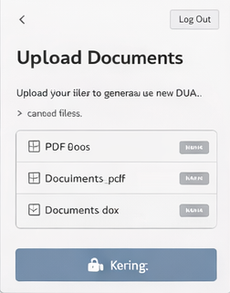
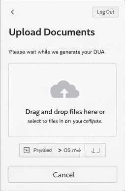
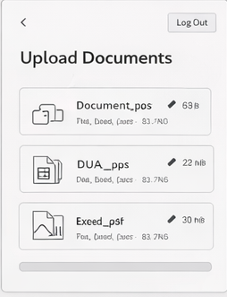

#### **Processing Progress**
During the document processing stage, the user can monitor the progress of the generation pipeline. The interface displays a progress bar and indicates the current step of the process.

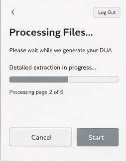

#### **DUA Result**
Once the process is completed, the generated DUA is displayed in a PDF preview interface. The user can review the document and download it as a PDF file.

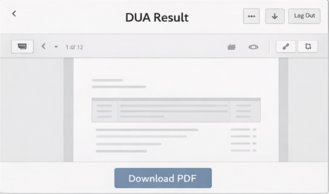

### Alternative view

Another version of the wireframes can be found here: [Coderick AI generated wireframes](https://preview-vc528368378939.coderick.net/?sgv=1772815747%3A26d1a14eb8605cde34bc344fd853adfda4a649cf18defbcff34d53228f4bfa68)

---

## 1.3 Component Design Strategy 
DUA Streamliner uses **Atomic Design** over a **component-based React architecture**. The interface is built from small reusable UI elements that are progressively composed into larger components and full pages. This approach improves consistency, maintainability, and scalability, while keeping presentation concerns separate from business logic.

Reusability is achieved by implementing shared UI elements only once and reusing them across screens. Common controls such as buttons, text fields, dialogs, upload areas, progress bars, tables, alerts, and PDF preview containers are placed in a shared component layer. Feature-specific components are then composed from those base elements. This reduces duplication and ensures that the same interaction patterns are preserved across the full application.

Styling is centralized through a single theme layer built on top of MUI. Colors, typography, spacing, border radius, shadows, and component variants are defined in in [`src/theme/theme.ts`](./src/theme/theme.ts) and propagated through the full application. This allows visual updates to be applied globally without modifying business components. Branding is handled in the same layer by defining the project color palette, logo usage, icon rules, and UI tokens as part of the shared theme configuration.

Internationalization is implemented through a centralized i18n configuration, where all user-facing labels, messages, button texts, and validation messages are externalized into locale files such as [`src/i18n/en.json`](./src/i18n/en.json) and [`src/i18n/es.json`](./src/i18n/es.json) of being hardcoded inside components. This makes the UI language-independent and simplifies future support for multiple languages, currencies, and regional formats.

Responsiveness is addressed at the component level using responsive layouts, breakpoints, and adaptive sizing rules. Components are designed to work consistently across desktop, tablet, and mobile browser widths, while preserving readability and workflow clarity. Since responsiveness is solved in the shared component system, the behavior propagates to the rest of the screens without redefining each page independently.

Accessibility is also enforced at the component level. Shared components follow consistent semantic structure, keyboard navigation rules, visible focus states, sufficient contrast, and reusable feedback patterns. This makes accessibility improvements scalable, because once a shared component is improved, the change benefits all screens that reuse it.

Strategy Summary

### Strategy Summary

- **Name of the strategy:** Atomic Design with component-based React architecture
- **Reutilization by:** shared components in [`src/components/atoms/`](./src/components/atoms/), [`src/components/molecules/`](./src/components/molecules/), [`src/components/organisms/`](./src/components/organisms/), [`src/components/templates/`](./src/components/templates/), and page composition in [`src/components/pages/`](./src/components/pages/)
- **Internationalization by:** centralized locale resources in [`src/i18n/`](./src/i18n/)
- **Responsiveness by:** responsive MUI layouts, theme breakpoints in [`src/theme/theme.ts`](./src/theme/theme.ts), and adaptive page composition in [`src/components/templates/`](./src/components/templates/)

### Suggested Component Structure
```text
src/
  components/
    atoms/
    molecules/
    organisms/
    templates/
    pages/
  hooks/
  theme/
  i18n/
```

---

## 1.4 Security
Security in DUA Streamliner follows modern web application security principles, focusing on authentication, authorization, session handling, and safe management of sensitive information. The frontend uses custom JWT-based authentication, secure route protection, and centralized session-aware services, while sensitive values remain outside the source code.

Authentication is implemented with email or username, password, and a one-time token sent by email as a lightweight multi-factor mechanism. The frontend consumes the authentication flow through [`src/auth/authProvider.tsx`](./src/auth/authProvider.tsx), [`src/services/authService.ts`](./src/services/authService.ts), and [`src/api/authApiClient.ts`](./src/api/authApiClient.ts). After successful login, the backend issues a JWT token used to protect subsequent requests.

The project uses **independent authentication** instead of external Single Sign-On. This keeps the architecture simpler and gives the platform full control over users, claims, and roles. Authorization is implemented using **Role-Based Access Control (RBAC)**. Authenticated users are assigned roles and claims, and route-level protection is enforced through [`src/auth/authGuard.tsx`](./src/auth/authGuard.tsx) and [`src/auth/permissionGuard.tsx`](./src/auth/permissionGuard.tsx).

The frontend session is managed through JWT tokens, protected navigation, and centralized auth state. Sensitive configuration values such as API endpoints, client configuration, and runtime environment variables are kept in [`src/settings/env.ts`](./src/settings/env.ts) and deployment-level secret storage.

### Security-Related Classes and Location

```text
src/
  auth/
    authProvider.tsx
    authGuard.tsx
    permissionGuard.tsx

  services/
    authService.ts

  api/
    authApiClient.ts

  settings/
    env.ts
```

### Roles
Typical roles within the system include:

- Importer / Exporter – Users who generate and manage DUA declarations.
- Customs Officer – Users who review submitted declarations.
- Administrator – Users who manage system configurations and permissions.

RBAC simplifies permission management while maintaining clear separation of responsibilities between different user groups. The authorization rules are enforced in the backend through middleware or guards that validate the user's role and permissions before executing protected operations.

### Permissions and Claims

Permissions within the system are defined using structured claims, which represent the actions a user can perform. These claims can be embedded inside the authentication token or validated on the server side.

| Code               | Description                                                       |
| ------------------ | ----------------------------------------------------------------- |
| CREATE-DUA         | Allows the user to generate a new DUA declaration.                |
| UPLOAD-DOCUMENT    | Allows the user to upload supporting documents for a declaration. |
| VIEW-DUA           | Allows the user to view previously generated declarations.        |
| EDIT-DUA           | Allows the user to modify declaration data before submission.     |
| REVIEW-DUA         | Allows customs officers to review submitted declarations.         |
| ADMIN-MANAGE-USERS | Allows administrators to manage user accounts and roles.          |


These claims are evaluated by the backend authorization layer to ensure that users only perform actions allowed by their role.

---

## 1.5 Layered Design
The DUA Streamliner frontend is organized as a layered architecture by responsibility. Each layer isolates a specific concern of the web application, allowing the UI, workflow orchestration, security, validation, external communication, and system configuration to evolve independently. This improves maintainability, testability, and consistency across the main flows of the platform.

The execution starts in the **Authentication Layer** and **Authorization Layer**, which control secure access, session awareness, and role-based route protection. The **Routing Layer**, implemented in [`src/router/appRouter.tsx`](./src/router/appRouter.tsx) and [`src/router/protectedRoute.tsx`](./src/router/protectedRoute.tsx), connects the main screens and defines protected navigation between login, history, generator configuration, upload, processing, and result pages.

The **Component Layer** is the visual layer of the application and follows the Atomic Design strategy selected for the project. It is composed of atoms, molecules, organisms, templates, and pages inside [`src/components/`](./src/components/). React hooks in [`src/hooks/`](./src/hooks/) are placed close to this layer because they are triggered from components and coordinate user interactions such as login submission, document upload, DUA generation, and history loading.

Below the UI, the **DUA Workflow Services** layer orchestrates the main frontend use cases. It coordinates authentication flow, file upload, generation requests, progress tracking, history retrieval, and result delivery through services in [`src/services/`](./src/services/). This layer consumes API clients in [`src/api/`](./src/api/), applies schemas from [`src/validation/`](./src/validation/) before and after external calls, and reads configuration from [`src/settings/`](./src/settings/).

Supporting layers complete the architecture. The **Models Layer** in [`src/models/`](./src/models/) defines frontend domain objects such as `User`, `DUA`, `Document`, `Goods`, and `GenerationJob`. The **State Management Layer** in [`src/state/`](./src/state/) stores global application state such as session status, current workflow step, generated declarations, and upload progress. The **Utilities Layer** in [`src/utils/`](./src/utils/) contains reusable helpers and formatters. The **Observability / Notifications Layer** in [`src/observability/`](./src/observability/) captures frontend errors, telemetry events, process logs, and user-facing notifications.

### Typical Responsibility Layers
- Authentication Layer
- Authorization Layer
- Routing Layer
- Component Layer
- Hooks Layer
- DUA Workflow Services
- Validation Layer
- API Clients Layer
- Settings Layer
- Models Layer
- State Management
- Utilities Layer
- Observability / Notifications

### Suggested Folder Architecture
```
src/
  auth/
    authProvider.tsx
    authGuard.tsx
    permissionGuard.tsx

  router/
    appRouter.tsx
    protectedRoute.tsx

  components/
    atoms/
    molecules/
    organisms/
    templates/
    pages/

  hooks/
    useAuth.ts
    useDuaGeneration.ts
    useUploadDocuments.ts
    useDuaHistory.ts

  services/
    authService.ts
    duaGenerationService.ts
    fileUploadService.ts
    duaHistoryService.ts
    notificationService.ts

  api/
    httpClient.ts
    authApiClient.ts
    duaApiClient.ts
    uploadApiClient.ts

  validation/
    authSchemas.ts
    uploadSchemas.ts
    duaSchemas.ts
    responseSchemas.ts

  state/
    store.ts
    slices/

  models/
    User.ts
    DUA.ts
    Document.ts
    Goods.ts
    GenerationJob.ts
    factories/
      duaFactory.ts

  utils/
    formatters.ts
    fileHelpers.ts
    dateUtils.ts

  settings/
    env.ts
    routes.ts
    constants.ts

  observability/
    logger.ts
    telemetry.ts
    errorTracking.ts
```
### Execution Flow
- The user enters the application through the authentication flow.
- Authorization and routing validate access to protected screens.
- Pages are built from atoms, molecules, organisms, templates, and hooks.
- Hooks trigger DUA workflow services.
- Services validate input and delegate backend communication to API clients.
- API clients use centralized settings and endpoints.
- Responses are validated and mapped into frontend models.
- State management stores the updated session, workflow, and result data.
- Components re-render the UI.
- Observability captures logs, errors, progress events, and notifications.

### Layered Design Diagram
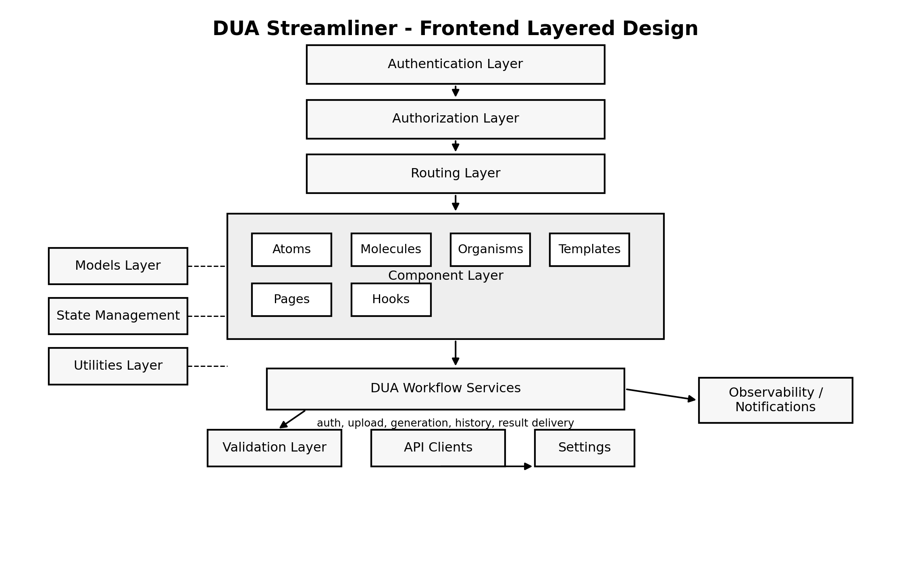
### Mermaid Diagram
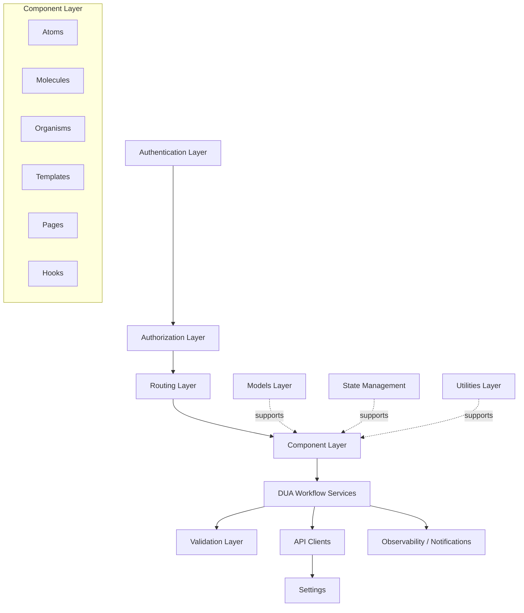
---
## 1.6 Design Patterns
The frontend applies object-oriented and architectural patterns only where they add clarity to the workflow.
- The **Provider pattern** is used for authentication context and shared application state. It centralizes session awareness in [`src/auth/authProvider.tsx`](./src/auth/authProvider.tsx) and avoids passing auth state through multiple component levels.
- The **Guard pattern** is used for route protection and permission validation. [`src/auth/authGuard.tsx`](./src/auth/authGuard.tsx) protects authenticated routes and [`src/auth/permissionGuard.tsx`](./src/auth/permissionGuard.tsx) protects role- or claim-based actions.
- The **Singleton pattern** is used for the shared HTTP client in [`src/api/httpClient.ts`](./src/api/httpClient.ts) so that API configuration, interceptors, and authentication headers are defined once.
- The **Factory pattern** is used to build frontend domain objects such as `DUA`, `Document`, or `GenerationJob` from API responses before they reach the UI through [`src/models/factories/duaFactory.ts`](./src/models/factories/duaFactory.ts).
- The **Observer pattern** is applied through state subscriptions and reactive UI updates. Components refresh automatically when the global store in [`src/state/store.ts`](./src/state/store.ts) changes or when workflow hooks in [`src/hooks/useDuaGeneration.ts`](./src/hooks/useDuaGeneration.ts) receive new progress state.
- The **Strategy pattern** is used where behavior may vary by configuration, such as document upload handling, template selection, or confidence rendering, mainly inside [`src/services/duaGenerationService.ts`](./src/services/duaGenerationService.ts), [`src/services/fileUploadService.ts`](./src/services/fileUploadService.ts), and reusable UI components in [`src/components/`](./src/components/).
- The **Facade pattern** is used in the workflow services layer. Services such as [`src/services/duaGenerationService.ts`](./src/services/duaGenerationService.ts) expose simple methods to the UI while internally coordinating validation, API calls, settings, and notifications.
- The **Interceptor pattern** is applied in [`src/api/httpClient.ts`](./src/api/httpClient.ts) to inject tokens, handle authorization failures, and support session invalidation.
- The **Pub/Sub pattern** is used for notifications and progress events. [`src/services/notificationService.ts`](./src/services/notificationService.ts) and the observability modules in [`src/observability/`](./src/observability/) allow upload and generation status to update the UI without tight coupling.

### Pattern Usage and Location

| Pattern | Purpose | Main Location |
|---|---|---|
| Provider | Authentication and shared app context | [`src/auth/authProvider.tsx`](./src/auth/authProvider.tsx) |
| Guard | Route and permission protection | [`src/auth/authGuard.tsx`](./src/auth/authGuard.tsx), [`src/auth/permissionGuard.tsx`](./src/auth/permissionGuard.tsx) |
| Singleton | Shared HTTP client | [`src/api/httpClient.ts`](./src/api/httpClient.ts) |
| Factory | Build domain models from API data | [`src/models/factories/duaFactory.ts`](./src/models/factories/duaFactory.ts) |
| Observer | UI refresh from state changes | [`src/state/`](./src/state/), [`src/hooks/`](./src/hooks/) |
| Strategy | Variable workflow behavior | [`src/services/duaGenerationService.ts`](./src/services/duaGenerationService.ts), [`src/services/fileUploadService.ts`](./src/services/fileUploadService.ts) |
| Facade | Simplified orchestration for UI calls | [`src/services/duaGenerationService.ts`](./src/services/duaGenerationService.ts) |
| Interceptor | Token injection and session invalidation | [`src/api/httpClient.ts`](./src/api/httpClient.ts) |
| Pub/Sub | Notifications and progress events | [`src/services/notificationService.ts`](./src/services/notificationService.ts), [`src/observability/`](./src/observability/) |
---
## 1.7 `/src` Scaffold

```text
src/
  auth/
    authProvider.tsx
    authGuard.tsx
    permissionGuard.tsx

  router/
    appRouter.tsx
    protectedRoute.tsx

  components/
    atoms/
      Button.tsx
      InputField.tsx
      ProgressBar.tsx
    molecules/
      LoginForm.tsx
      FileUploadBox.tsx
      ConfidenceBadge.tsx
    organisms/
      HistoryTable.tsx
      GeneratorConfigForm.tsx
      PdfViewerPanel.tsx
    templates/
      AuthTemplate.tsx
      DashboardTemplate.tsx
      WorkflowTemplate.tsx
    pages/
      LoginPage.tsx
      SelectOptionPage.tsx
      DuaHistoryPage.tsx
      GeneratorConfigurationPage.tsx
      UploadDocumentsPage.tsx
      ProcessingProgressPage.tsx
      DuaResultPage.tsx

  hooks/
    useAuth.ts
    useDuaGeneration.ts
    useUploadDocuments.ts
    useDuaHistory.ts

  services/
    authService.ts
    duaGenerationService.ts
    fileUploadService.ts
    duaHistoryService.ts
    notificationService.ts

  api/
    httpClient.ts
    authApiClient.ts
    duaApiClient.ts
    uploadApiClient.ts

  validation/
    authSchemas.ts
    uploadSchemas.ts
    duaSchemas.ts
    responseSchemas.ts

  state/
    store.ts
    slices/
      authSlice.ts
      duaSlice.ts
      uploadSlice.ts

  models/
    User.ts
    DUA.ts
    Document.ts
    Goods.ts
    GenerationJob.ts
    factories/
      duaFactory.ts

  utils/
    formatters.ts
    fileHelpers.ts
    dateUtils.ts

  settings/
    env.ts
    routes.ts
    constants.ts

  observability/
    logger.ts
    telemetry.ts
    errorTracking.ts

  i18n/
    en.json
    es.json

  theme/
    theme.ts
``` 
---

# 2. Backend Design
## 2.1 Technology Stack
The backend follows a modular monolith architecture inside the same repository. This approach keeps the system easier to develop and document than a microservices design, while still separating responsibilities clearly across API, application, domain, infrastructure, and worker layers.
- **Architecture style:** Modular monolith
- **API style:** REST API over HTTPS
- **Backend framework:** ASP.NET Core 10 Web API
- **Backend language:** C# 14
- **Open API standard:** OpenAPI 3.1
- **Primary execution model:** synchronous API + asynchronous job processing
- **Object storage:** Amazon S3
- **Queueing:** Amazon SQS
- **Secrets storage:** AWS Secrets Manager
- **Container hosting:** AWS ECS Fargate
- **Database:** Amazon RDS for PostgreSQL
- **Observability:** Amazon CloudWatch + OpenTelemetry
- **CI/CD:** GitHub Actions
- **Infrastructure as Code:** Terraform
- **Repository model:** practical monorepo with frontend at ./src and backend at ./backend
- **API Gateway / Edge Protection:** Amazon API Gateway
- **Transport protocol:** HTTPS over TCP
- **Contract standard:** OpenAPI 3.1
- **Business logic paradigm:** request/response API + asynchronous event-driven jobs

.NET 10 is currently an LTS release, C# 14 is the current C# version supported on .NET 10, and ASP.NET Core 10 includes built-in OpenAPI support with OpenAPI 3.1 generation.

---
## 2.2 Security
The backend security model is aligned with the frontend design already defined in the project. Authentication is implemented through custom JWT-based authentication with email OTP verification, keeping the same independent authentication strategy already documented for the frontend.

All backend traffic is exposed only through HTTPS. Sensitive data at rest is encrypted using managed cloud encryption. For relational data, Amazon RDS encrypted instances use AES-256 at rest. For uploaded files and generated outputs, Amazon S3 applies server-side encryption by default, using 256-bit AES encryption.

The system uses RBAC for authorization, matching the permission model already defined in the frontend README. Claims such as CREATE-DUA, UPLOAD-DOCUMENT, VIEW-DUA, and REVIEW-DUA are validated in the backend before protected use cases are executed.

To reduce abuse risk, the public API enforces:
- maximum payload limits for file upload endpoints,
- stricter limits for non-upload endpoints,
- request throttling and quotas,
- secure secret storage through AWS Secrets Manager.

Amazon API Gateway supports throttling and usage plans, which can be used to enforce request limits at API or method level.

---
## 2.3 Observability
The backend records both operational and business events. Operational events include authentication failures, upload failures, processing exceptions, queue retries, callback errors, and infrastructure health issues. Business events include file upload started, file upload completed, extraction started, extraction completed, DUA generation completed, and DUA download requested.

These events are sent to Amazon CloudWatch, while traces and distributed execution telemetry are captured through OpenTelemetry. Dashboards for operational analysis are built on top of CloudWatch metrics and logs. AWS services publish metrics to CloudWatch, which makes it suitable as the central observability platform for the backend.

---
## 2.4 Infrastructure (DevOps)
The backend is deployed from the same repository as the frontend, but as an independent module inside `./backend`. CI/CD is handled through GitHub Actions, and infrastructure provisioning is handled through Terraform. This remains consistent with the frontend stack already documented in the project README.

The deployment flow is:

- push or merge into the repository,
- run backend linting, tests, and build,
- build API and worker container images,
- push images to ECR,
- apply Terraform changes,
- deploy to ECS Fargate by environment.

AWS Prescriptive Guidance includes patterns for Terraform-managed AWS infrastructure deployed through GitHub Actions, which aligns well with this repository model.

---
## 2.5 Availability
The target availability for the backend is 99.9% uptime. The design avoids a single-process backend by separating the public API from asynchronous workers. ECS Fargate services should run with at least two tasks for the API in higher environments, while queues decouple frontend-triggered operations from long-running processing jobs.

Potential single points of failure are:
- a single database instance,
- a single worker replica,
- misconfigured secrets or IAM policies,
- queue backlog saturation,
- failure in the external OCR or semantic extraction provider.

Recovery is handled through container restart, queue retry policies, health checks, infrastructure redeployment, and backup/restore procedures.

---
## 2.6 Scalability

Scalability is driven mainly by request volume and file-processing workload. The elements that scale first are:
- API tasks in ECS Fargate,
- worker tasks in ECS Fargate,
- SQS queue depth,
- S3 storage volume,
- RDS compute and storage,
- observability volume in logs and traces.

The API layer scales horizontally with incoming request rate. The worker layer scales independently according to queue backlog, which is especially important for OCR, parsing, semantic extraction, and DUA rendering.

---
## 2.7 Backend Key Workflows 

### Upload Files to Generate DUA
1. The backend receives the upload request and metadata for the generation job.
2. Files are streamed and stored in Amazon S3.
3. A generation job is created in the database.
4. A message is published to Amazon SQS.
5. A worker consumes the job and starts file processing.
6. Parsed and extracted data is validated and normalized.
7. The DUA draft is generated and stored.
8. The job status is updated and exposed to the frontend.

### Generate DUA from Uploaded Documents
1. The worker loads the uploaded documents from S3.
2. The system detects file type and selects the corresponding document processor.
3. OCR is executed for scanned images when needed.
4. Structured and unstructured data is extracted.
5. Semantic extraction maps the data into DUA fields.
6. Validation rules check consistency, required fields, and confidence thresholds.
7. The output document is rendered and saved.
8. A completion event is emitted for monitoring and user notification.

### Setup DUA Template
1. An authorized user uploads or selects a DUA template version.
2. The backend validates template metadata and version rules.
3. The template is stored in persistent storage.
4. The selected template becomes available for future generation workflows.

---
## 2.8 Architecture diagrams in layers

### C4 – Context Diagram
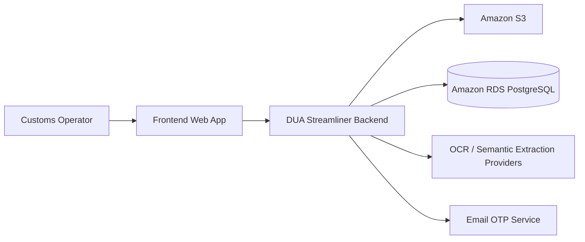

### C4 – Container Diagram
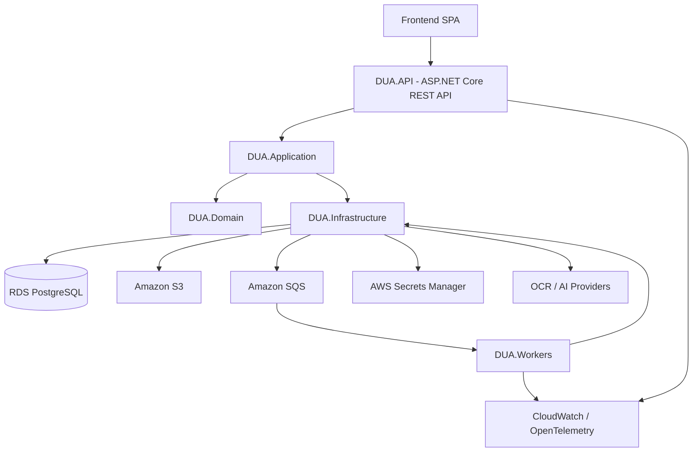

### Code Layer Diagram
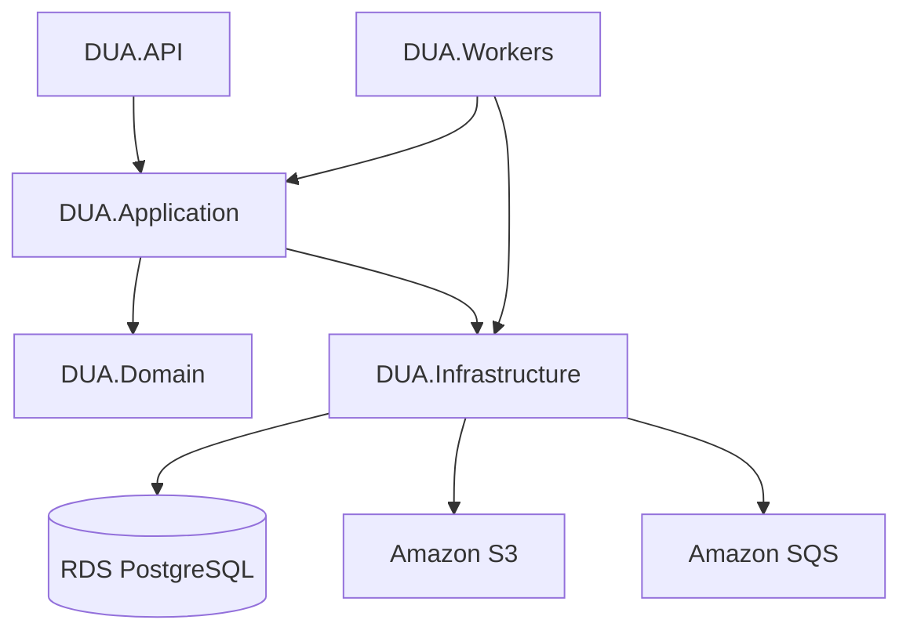

---
## 2.9 Design Considerations
- The backend keeps the same repository as the frontend to simplify delivery, review, and traceability of commits.
- Long-running operations are asynchronous by design.
- Business rules must remain in the application and domain layers, not in controllers.
- Secrets and sensitive environment values are never stored in source code.
- The backend must expose stable contracts for the frontend workflow already defined in the project.
- Storage, queueing, validation, OCR, and template rendering must remain replaceable through interfaces.

---
## 2.10 Source Code
The backend source code is organized as a practical monorepo module under ./backend/.

Key folders:
- [`backend/src/DUA.API/`](./backend/src/DUA.API/) 
- [`backend/src/DUA.Application/`](./backend/src/DUA.Application/)
- [`backend/src/DUA.Domain/`](./backend/src/DUA.Domain/)
- [`backend/src/DUA.Infrastructure/`](./backend/src/DUA.Infrastructure/)
- [`backend/src/DUA.Workers/`](./backend/src/DUA.Workers/)
- [`backend/tests/`](./backend/tests/)
- [`backend/terraform/`](./backend/terraform/)

---