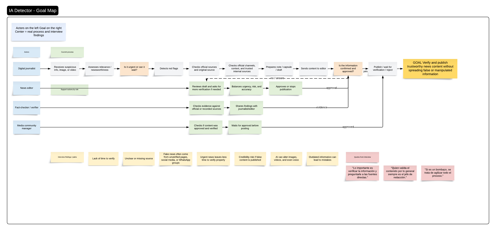

# Goal Map — IA Detector

## Purpose

This document defines the goal map for IA Detector. It explains how the product supports the editorial verification process and where the system contributes value inside the user workflow.

The goal map is used to keep UX, frontend, backend, data design, and MVP implementation aligned around the same product objective.

---

## Problem Statement

**Reduce the time to confirm truthfully information.**

---

## Main Product Goal

Reduce the time journalists need to verify suspicious digital content before using it in an editorial process.

IA Detector supports this goal by helping the user:

- submit suspicious content,
- extract the main claim,
- search evidence,
- detect risk signals,
- calculate verification scores,
- classify the case as `PASS`, `NO_PASS`, or `HUMAN_REVIEW`,
- save the case in history with a basic audit log.

---

## Goal Map Image

The visual goal map must be stored in:

`docs/diagrams/goal-map.png`

Reference:

---

## Main Actors

| Actor | Role in the workflow |
|---|---|
| Journalist | Submits suspicious content and reviews the result before using the information. |
| Editor | Reviews ambiguous or sensitive cases when human validation is required. |
| IA Detector | Extracts claims, searches evidence, calculates scores, and classifies the case. |
| Evidence Provider | External or internal source used to support or reject a claim. |

---

## Main Workflow

1. Journalist receives suspicious information from a digital source.
2. Journalist opens IA Detector.
3. Journalist submits text, URL, image, or screenshot.
4. IA Detector extracts the main claim.
5. IA Detector searches evidence or previous fact-check results.
6. IA Detector calculates:
   - `evidenceScore`
   - `riskScore`
   - `sourceAgreement`
7. IA Detector classifies the case as:
   - `PASS`
   - `NO_PASS`
   - `HUMAN_REVIEW`
8. Journalist reviews the evidence, scores, risk signals, and classification.
9. The case is saved in verification history.
10. A basic audit log entry is created.

---

## Goal Breakdown

| Goal | System contribution | MVP feature |
|---|---|---|
| Reduce manual verification time | Automates claim extraction and evidence search. | Text, URL, and image/screenshot submission. |
| Help users understand evidence faster | Shows evidence sources, scores, and risk signals in one result page. | Results page. |
| Avoid absolute truth claims | Uses `PASS`, `NO_PASS`, and `HUMAN_REVIEW` instead of `TRUE` or `FALSE`. | Classification badge. |
| Support ambiguous cases | Routes unclear cases to human review. | `HUMAN_REVIEW` state. |
| Preserve traceability | Saves the case and records basic audit events. | History and audit log. |

---

## IA Detector Decision States

| State | Meaning |
|---|---|
| `PASS` | The case can move forward to editorial review based on available evidence. |
| `NO_PASS` | The case should not move forward with the available evidence. |
| `HUMAN_REVIEW` | The case is ambiguous and requires human review. |

---

## System Boundaries

IA Detector is responsible for:

- receiving suspicious content,
- extracting or receiving a claim,
- searching evidence,
- calculating scores,
- classifying the case,
- showing evidence and risk signals,
- saving verification history.

IA Detector is not responsible for:

- publishing content automatically,
- declaring absolute truth,
- replacing editorial judgment,
- performing real deepfake detection in the MVP,
- running advanced image forensic analysis in the MVP.

---

## MVP Alignment

The MVP must implement the workflow represented in this goal map.

Required MVP screens:

- Dashboard / Verification Hub.
- Text submission.
- URL submission.
- Image or screenshot upload.
- Processing state.
- Results page.
- Verification history.

Required MVP outputs:

- extracted claim,
- evidence list,
- `evidenceScore`,
- `riskScore`,
- `sourceAgreement`,
- risk signals,
- final classification: `PASS`, `NO_PASS`, or `HUMAN_REVIEW`.

---

## Acceptance Criteria

The goal map is correctly represented in the MVP when:

- A user can submit suspicious text, URL, image, or screenshot.
- The system shows a processing state before results.
- The system displays evidence and risk signals.
- The system classifies the case as `PASS`, `NO_PASS`, or `HUMAN_REVIEW`.
- The system does not show `TRUE` or `FALSE` as final result labels.
- The case can be saved in history.
- The workflow matches the prototype and frontend design documentation.